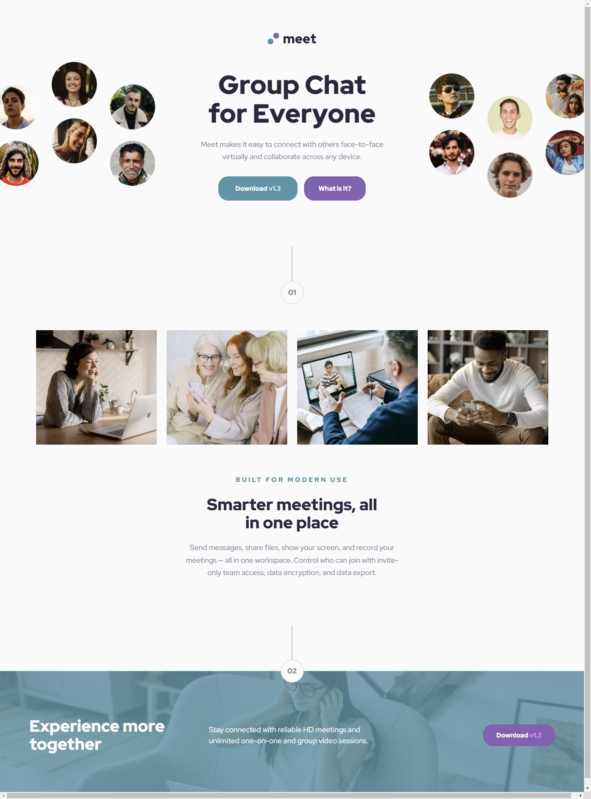

# Frontend Mentor - Meet landing page solution

This is a solution to the [Meet landing page challenge on Frontend Mentor](https://www.frontendmentor.io/challenges/meet-landing-page-rbTDS6OUR). Frontend Mentor challenges help you improve your coding skills by building realistic projects. 

## Table of contents

- [Overview](#overview)
  - [The challenge](#the-challenge)
  - [Screenshot](#screenshot)
- [My process](#my-process)
  - [Built with](#built-with)
  - [What I learned](#what-i-learned)
  - [Key Features](#key-features)

## Overview

### The challenge

Users should be able to:

- View the optimal layout depending on their device's screen size
- See hover states for interactive elements

### Screenshot

## My process

### Built with

- Semantic HTML5 markup
- SCSS/SASS
- Modern CSS Features:
  - CSS Custom Properties
  - CSS Grid
  - Flexbox
  - clamp() for fluid typography
- Mobile-first workflow
- Organized SCSS architecture:
  - Abstracts (variables, mixins, functions)
  - Base styles
  - Components
  - Layouts

### What I learned

- Implemented a robust responsive design system using SCSS mixins and a mobile-first approach
- Mastered fluid typography using clamp() for seamless text scaling across viewports
- Created a maintainable SCSS architecture separating concerns into logical folders
- Utilized modern CSS Grid and Flexbox for complex layouts
- Implemented an 8pt spacing system using SCSS variables for consistent spacing

### Key Features

1. **Responsive Design**
   - Mobile-first approach
   - Breakpoint system using em units:
     - sm: 36em (576px)
     - md: 48em (768px)
     - lg: 62em (992px)
     - xl: 75em (1200px)

2. **Typography**
   - Fluid typography implementation using clamp()
   - Consistent type scale across breakpoints
   - Accessible text contrast ratios

3. **Spacing System**
   - 8pt grid system using rem units
   - Consistent spacing patterns:
     - spacing-800 for mobile/tablet layouts
     - spacing-1400 vertical and spacing-1000 horizontal for desktop layouts

4. **CSS Architecture**
   - Modular SCSS structure
   - Custom properties for theming
   - Reusable components and utility classes
