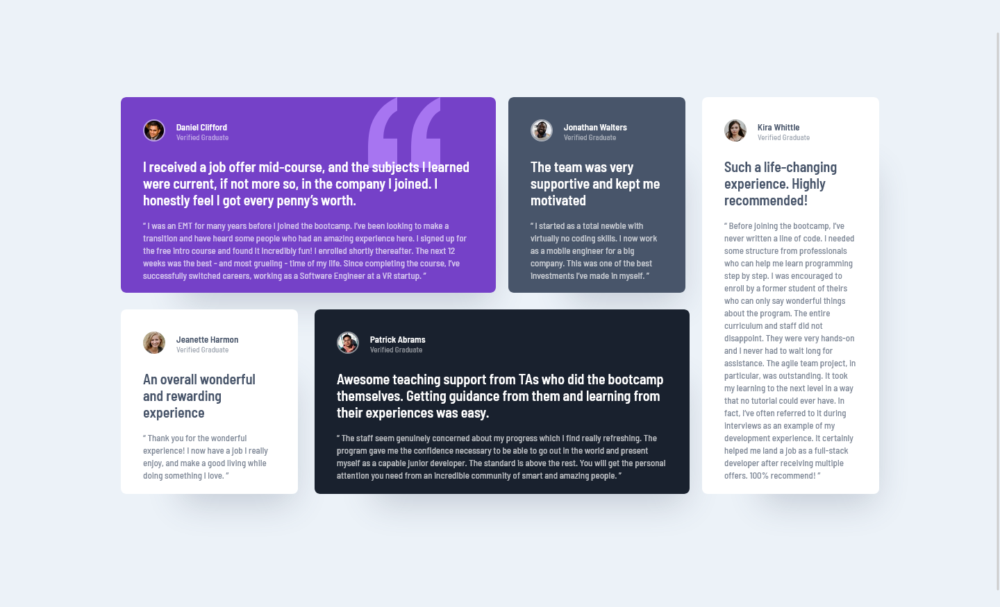

# Frontend Mentor - Testimonials Grid Section Solution

This is my solution to the [Testimonials grid section challenge on Frontend Mentor](https://www.frontendmentor.io/challenges/testimonials-grid-section-Nnw6J7Un7). Frontend Mentor challenges help improve coding skills for building realistic projects with semantic HTML, mobile-first CSS, and vanilla JavaScript.

## Table of Contents

- [Overview](#overview)
  - [The Challenge](#the-challenge)
  - [Screenshot](#screenshot)
  - [Links](#links)
- [My Process](#my-process)
  - [Built With](#built-with)
  - [What I Learned](#what-i-learned)  
  - [Useful Resources](#useful-resources)
- [Acknowledgments](#acknowledgments)

## Overview

### The Challenge

Users should be able to:  
- View the optimal layout for the site depending on their device's screen size.  
- Experience a clean, accessible, and responsive layout built with semantic HTML and modern CSS.

### Screenshot

  <strong>Desktop View</strong> 
  A clean design showcasing the layout with distinct testimonial cards.  
  

  <strong>Mobile View</strong> 
  Responsive layout optimized for mobile devices with proper spacing and gaps.  
  

### Links

- **Solution URL:** [https://github.com/stevensuna/fem/tree/main/testimonials-grid-section-main](https://github.com/stevensuna/fem/tree/main/testimonials-grid-section-main)
- **Live Site URL:** [https://stevensuna.github.io/fem/testimonials-grid-section-main/](https://stevensuna.github.io/fem/testimonials-grid-section-main/)

## My Process

### Built With

- **Semantic HTML5** – Clean, accessible markup.
- **Mobile-First Responsive CSS** – Layout adapts from mobile to desktop.
- **CSS Grid & Flexbox** – For precise positioning and spacing.
- **CSS Custom Properties** – For theming (colors, spacing, typography).
- **Version Control with Git** – Keeping incremental, meaningful commits.

### What I Learned

- **Responsive Design Techniques:** Using CSS Grid and custom properties to adjust layouts on various screen sizes.
- **CSS Spacing and Theming:** Implementing a mathematical progression for spacing (using variables like `--space-md`) and an accessible color scheme with HSL.
- **Git Workflow:** How to revert changes safely when needed and maintain clear commit messages.

### Useful Resources

- [Frontend Mentor](https://www.frontendmentor.io/)
- [MDN Web Docs](https://developer.mozilla.org/en-US/)
- [CSS Tricks - A Complete Guide to Grid](https://css-tricks.com/snippets/css/complete-guide-grid/)
- [The Markdown Guide](https://www.markdownguide.org/)

## Acknowledgments

Thank you to everyone who provided feedback and inspiration during this project. Special thanks to the Frontend Mentor community and the various online resources that helped refine my workflow.
